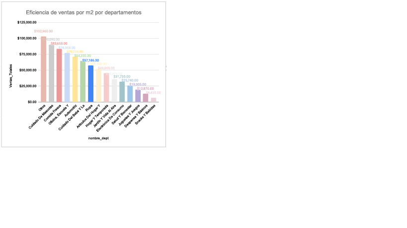
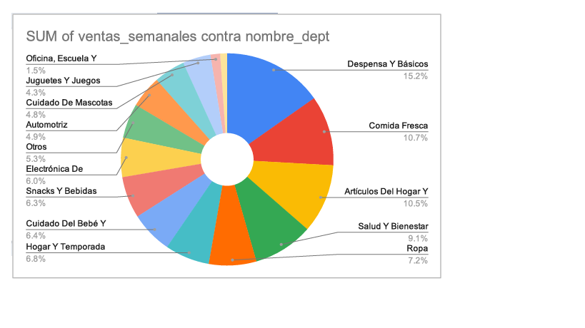

  
  <h1>¡Hola! Soy Jonathan Castillejos 👋</h1>
  
<strong>Analista de Datos | Especialista en SQL, Python y Business Intelligence</strong>

  
<i>"Transformando datos complejos en decisiones estratégicas de negocio a través de visualización avanzada y modelado analítico."</i>

---

## 📂 Proyectos Destacados

### 1. Análisis de Operaciones y Ventas - Walmart 🛒
> **Resumen:** Maximización de la rentabilidad operativa mediante el análisis de KPIs de ventas y eficiencia de espacio por departamento.

  
   
  
<i>Dashboard de Eficiencia de Ventas por m² por Departamento</i>

  
  <table style="width:100%; border:none; border-collapse: collapse;">
    <tr>
      <td style="width:50%; border:none; text-align:center; padding: 15px;">
        
         <b>Análisis de Tendencia Semanal</b>
        
<small>Monitoreo de fluctuaciones de demanda por periodo.</small>

      </td>
      <td style="width:50%; border:none; text-align:center; padding: 15px;">
        
         <b>Mix de Ventas por Categoría</b>
        
<small>Distribución porcentual del volumen de ventas interno.</small>

      </td>
    </tr>
  </table>

#### 🛠️ Metodología y Valor Agregado:
* **Data Wrangling:** Limpieza de datasets heterogéneos y normalización de nombres de departamentos mediante **SQL**.
* **Análisis de Eficiencia:** Cálculo de la métrica de Ventas Totales vs. Superficie asignada para detectar pasillos subutilizados.
* **Insights Clave:** La categoría "Cuidado de Mascotas" mostró un retorno de inversión por espacio superior a "Alimentos", lo que justifica una reestructuración del layout de la tienda.

**Tecnologías:**   

[📂 Ver Código y Reportes](./Proyecto_Walmart/) | [📊 Dashboard en Vivo](https://tu-link-aqui.com)

---

### 2. Análisis de Embudo y Retención - Mercado Libre 📦
> **Resumen:** Análisis profundo de la fidelización del usuario (Retention Rate) utilizando técnicas de cohortes para identificar fugas en el funnel de ventas.

  

#### 🛠️ Enfoque Técnico:
* **Segmentación por Cohortes:** Creación de grupos de usuarios basados en su mes de registro para medir la recurrencia.
* **Lógica SQL Avanzada:** Uso de **CTEs** para definir periodos de actividad (D7, D14, D21, D28) y funciones de ventana para comparar comportamientos.
* **QA Analítico:** Identificación de una caída drástica en el día 14, permitiendo al equipo de CRM activar disparadores de correo electrónico para retención.

**Tecnologías:**   

[📂 Ver Carpeta del Proyecto](./Proyecto_Embudo_ML/)

---

### 3. Análisis de Desempeño de Ventas 📈
> **Resumen:** Dashboards interactivos para el seguimiento de cuotas mensuales y proyecciones de cierre.

* **Herramientas:** Excel Pro (Power Query / Power Pivot) y modelado de datos en estrella.
* **Logro:** Automatización de reportes que antes tomaban 4 horas a solo 10 minutos de actualización.
* [📂 Ver Proyecto](./Proyecto_Desempeño_Ventas/)

---

### 4. Análisis de Movilidad Urbana - Python 🐍
> **Resumen:** Extracción de patrones de tráfico mediante procesamiento masivo de datos geoespaciales.

* **Herramientas:** Python (Pandas, Seaborn), Jupyter Notebooks.
* **Logro:** Procesamiento de más de 500k registros para visualizar horas pico y cuellos de botella urbanos.
* [📂 Ver Proyecto](./Proyecto_Python_Movilidad/)

---

## 🛠️ Habilidades Técnicas
* **Bases de Datos:** SQL (PostgreSQL, MySQL, BigQuery), Diseño de Esquemas, Optimización de Consultas.
* **Análisis & Programación:** Python (Pandas, Numpy, Scikit-learn), ETL, Análisis Estadístico.
* **Visualización:** Google Sheets Avanzado, Dashboards Interactivos, Data Storytelling.

---

  <h2>📬 Contacto</h2>
  
¿Te interesa mi perfil para fortalecer tus decisiones basadas en datos? ¡Hablemos!

  
  
  &nbsp;&nbsp;
  

