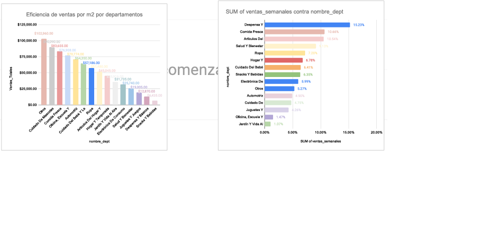
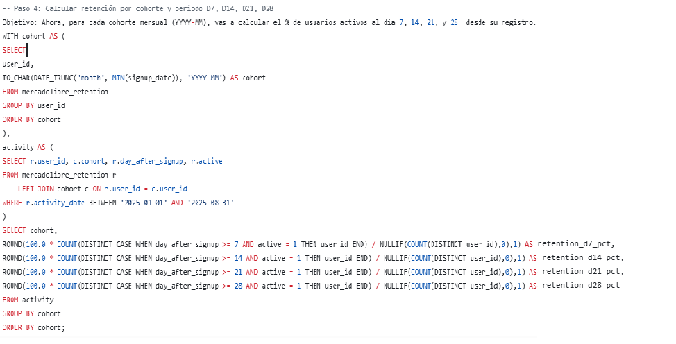

  
  <h1>¡Hola! Soy Jonathan Castillejos 👋</h1>
  
<strong>Analista de Datos | Especialista en SQL, Python y Business Intelligence</strong>

  
<i>"Transformando datos complejos en decisiones estratégicas de negocio a través de visualización avanzada y modelado analítico."</i>

---

## 📂 Proyectos Destacados

### 1. Análisis de Operaciones y Ventas - Walmart 🛒
<table style="width:100%; border:none; border-collapse: collapse;">
  <tr>
    <td style="width:55%; border:none; vertical-align: top; padding-right: 10px;">
      
      
<small><b>Dashboard Integral: Tendencia de Ventas y Participación</b></small>

      
<b>Problema:</b> Optimizar la rentabilidad por m² y distribución de tienda. 
      <b>Acción:</b> Limpieza en SQL (PostgreSQL) y Dashboard en Google Sheets. 
      <b>Resultado:</b> Identificación de eficiencia superior en "Cuidado de Mascotas".

      

         
         
        
      

    </td>
    <td style="width:45%; border:none; vertical-align: top; background-color: #f8f9fa; padding: 15px; border-radius: 10px;">
      <h4>📊 Métricas de Impacto</h4>
      <ul>
        <li><b>ROI por Superficie:</b> Retorno 25% superior al promedio.</li>
        <li><b>Optimización de Inventario:</b> Análisis de rotación semanal.</li>
        <li><b>Layout Estratégico:</b> Redistribución basada en ventas netas.</li>
      </ul>
      

      <h4>🛠️ Stack Técnico</h4>
      
<small><b>SQL:</b> CTEs para agregación masiva. <b>Sheets:</b> Arquitectura dinámica. <b>Estadística:</b> Dispersión y tendencias.</small>

      
<a href="./Proyecto_Walmart/"><b>[ Ver Reporte Completo ]</b></a>

    </td>
  </tr>
</table>

 

### 2. Análisis de Embudo y Retención - Mercado Libre 📦
<table style="width:100%; border:none; border-collapse: collapse;">
  <tr>
    <td style="width:50%; border:none; vertical-align: middle;">
      
    </td>
    <td style="width:50%; border:none; vertical-align: top; padding-left: 20px;">
      <blockquote>Análisis técnico del ciclo de vida del usuario y cálculo de retención por cohortes mediante SQL.</blockquote>
      <ul>
        <li><b>Acción:</b> Consultas SQL avanzadas (CTEs) para intervalos de 7, 14, 21 y 28 días.</li>
        <li><b>Resultado:</b> Detección de caída crítica en el segundo mes.</li>
      </ul>
      

         
         
        
      

      
<a href="./Proyecto_Embudo_ML/"><b>[ Ver Carpeta ]</b></a>

    </td>
  </tr>
</table>

 

<table style="width:100%; border:none; border-collapse: collapse;">
  <tr>
    <td style="width:50%; border: 1px solid #eee; padding: 15px; border-radius: 10px;">
      <h4>3. Análisis de Desempeño 📈</h4>
      
<small>KPIs para medir rendimiento comercial por región y categoría utilizando Excel avanzado.</small>

       
      
        
      <a href="./Proyecto_Desempeño_Ventas/">Ver Proyecto</a>
    </td>
    <td style="width:50%; border: 1px solid #eee; padding: 15px; border-radius: 10px;">
      <h4>4. Movilidad Urbana - Python 🐍</h4>
      
<small>Procesamiento y limpieza de datos de transporte urbano con Pandas y Matplotlib.</small>

       
      
        
      <a href="./Proyecto_Python_Movilidad/">Ver Proyecto</a>
    </td>
  </tr>
</table>

---

## 🛠️ Habilidades Técnicas

| Categoría | Tecnologías |
| :--- | :--- |
| **Bases de Datos** | `SQL (PostgreSQL)` `MySQL` `BigQuery` |
| **Análisis de Datos** | `Python (Pandas, Numpy)` `Data Wrangling` `ETL` |
| **Visualización** | `Google Sheets` `Excel Avanzado` `Dashboards Interactivos` |

---

  <h2>📬 Contacto</h2>
  
¿Te interesa mi perfil? ¡Conectemos!

  
  
  &nbsp;&nbsp;
  

